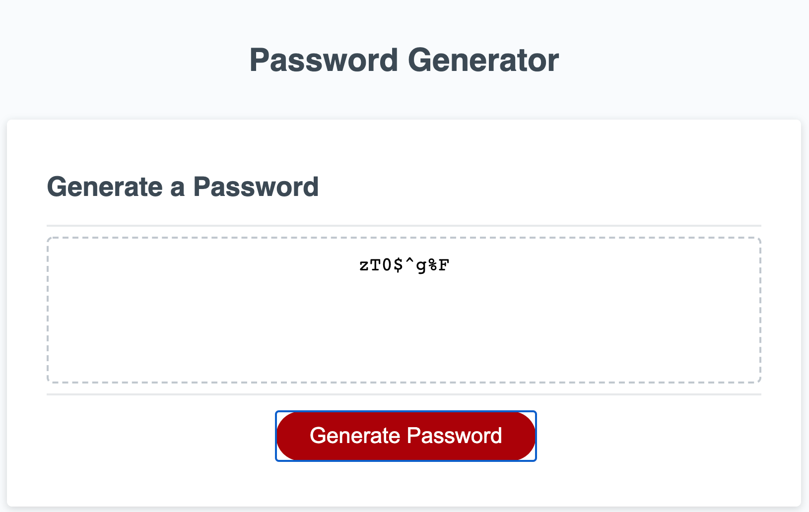
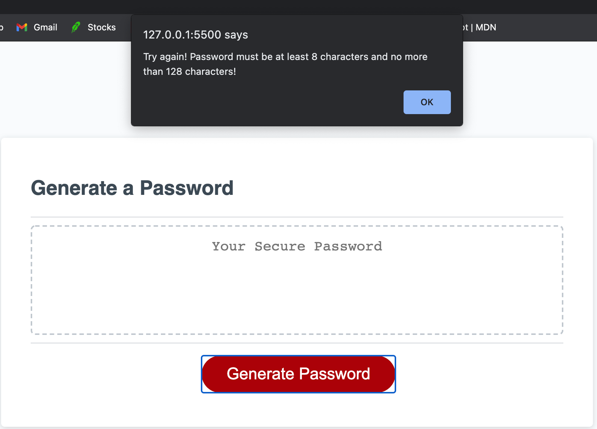
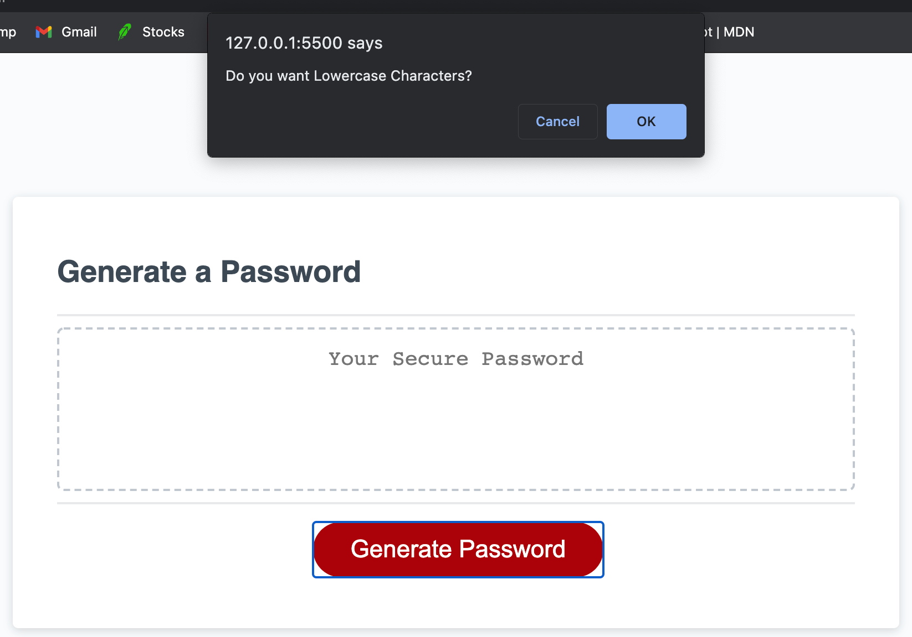
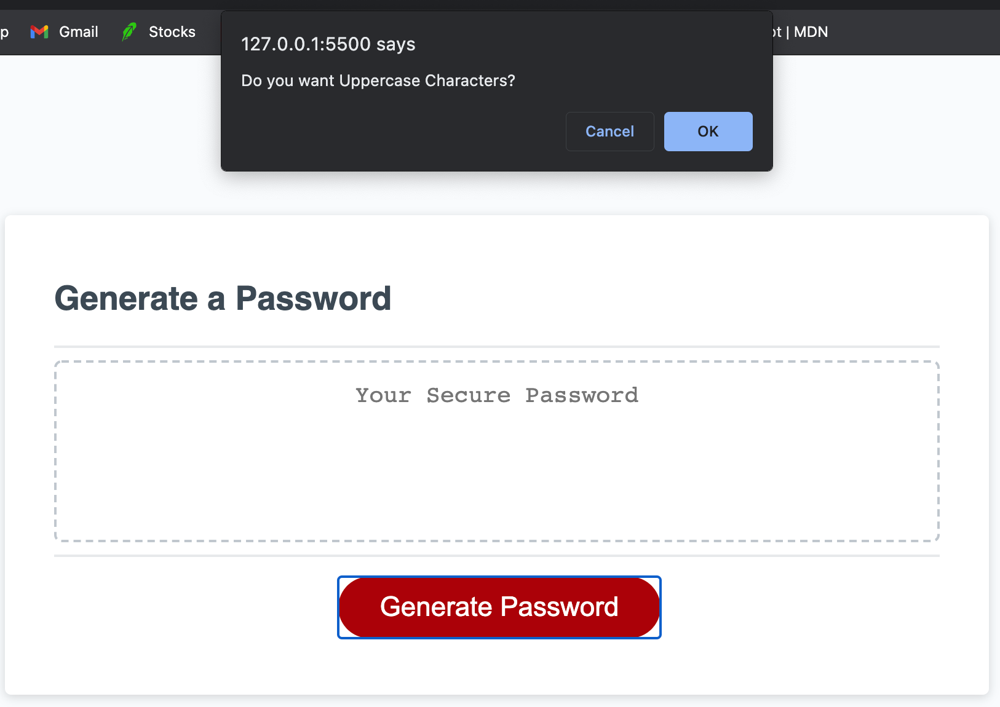
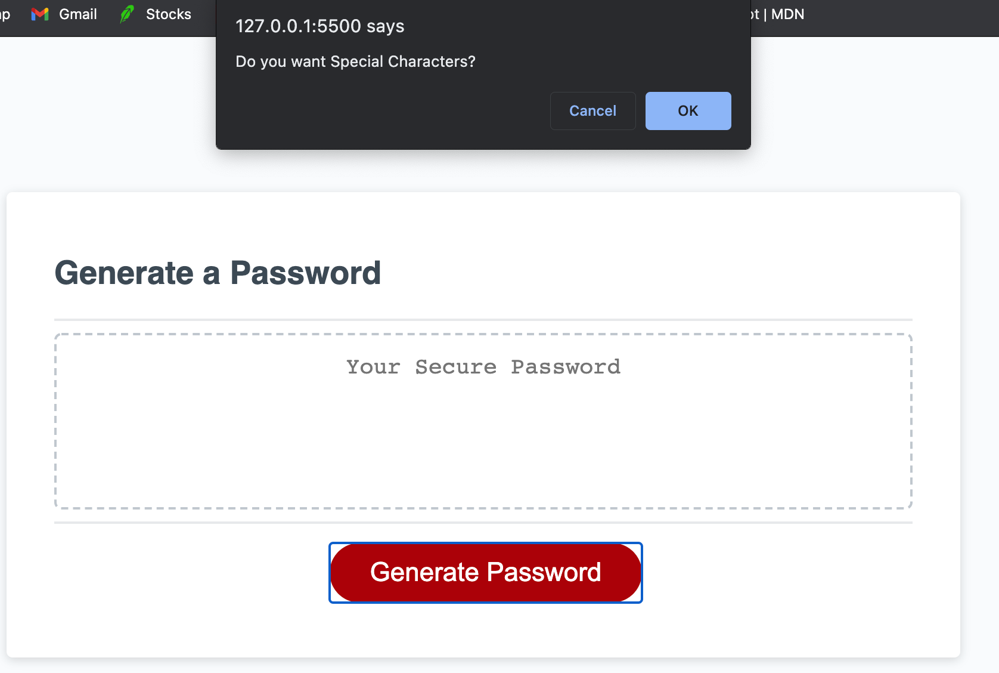
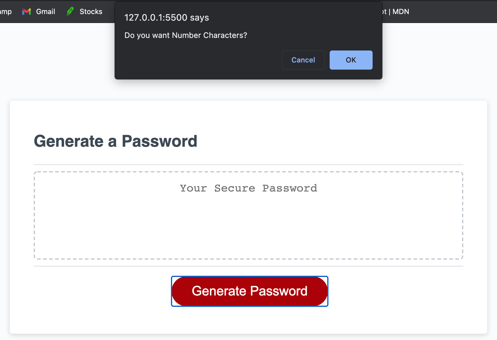
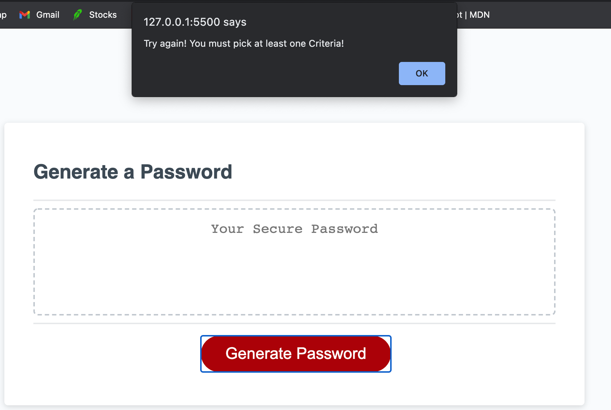

## Password Generator Javascript

## Description
- In this project I created a random password generator using javascript and a little bit of HTML and CSS.
- I learned a lot when it comes to Javascript and this project deeped my knownledge even more on using and understanding 
how useful it is. 
- This project was no easy task I was challenging yet enjoyable.
- I learned how to use functions, for loops, arrays, strings, math random and more.

## Installation
- Clone the Repo in your Terminal (for Mac) or Bash(for PC).
- Using SSH key: git clone 
- Using HTTPS key: git clone 

## Usage
- The webpage

- When button is clicked this Alert pops up asking for pass word length
![button]images/buttonpress.png
- If the pass word is less than 8 characters or more than 128 this will pop up

- Then user is asked if they would like Lowercase, Uppercase, numbers and symbols in the password

- If user doesnt at least click okay for a character type this will pop up

## Credits
- https://www.w3schools.com/css/
- https://www.google.com/
- https://stackoverflow.com/
- https://javascript.com
- https://developer.mozilla.org/en-US/
- Office Hours with John
- Classmate help from Christian

## License
- MIT License
Copyright (c) [2021] [Javier Perez]
- Permission is hereby granted, free of charge, to any person obtaining a copy
of this software and associated documentation files (the "Software"), to deal
in the Software without restriction, including without limitation the rights
to use, copy, modify, merge, publish, distribute, sublicense, and/or sell
copies of the Software, and to permit persons to whom the Software is
furnished to do so, subject to the following conditions:
The above copyright notice and this permission notice shall be included in all
copies or substantial portions of the Software.
THE SOFTWARE IS PROVIDED "AS IS", WITHOUT WARRANTY OF ANY KIND, EXPRESS OR
IMPLIED, INCLUDING BUT NOT LIMITED TO THE WARRANTIES OF MERCHANTABILITY,
FITNESS FOR A PARTICULAR PURPOSE AND NONINFRINGEMENT. IN NO EVENT SHALL THE
AUTHORS OR COPYRIGHT HOLDERS BE LIABLE FOR ANY CLAIM, DAMAGES OR OTHER
LIABILITY, WHETHER IN AN ACTION OF CONTRACT, TORT OR OTHERWISE, ARISING FROM,
OUT OF OR IN CONNECTION WITH THE SOFTWARE OR THE USE OR OTHER DEALINGS IN THE
SOFTWARE.